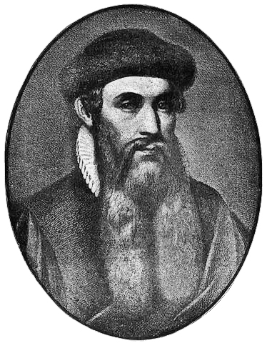

Hello World!!!

<figure class="floatRight">
	
	<figcaption>Johannes Gutenberg</figcaption>
</figure>

## HELLO WORLDDD

World

<figure class="floatLeft">
	
	<figcaption>Early wooden printing press as depicted in 1568.</figcaption>
</figure>

>Hello

*Movable metal type, and composing stick, descended from Gutenberg's press. Photo by Willi Heidelbach. Licensed under CC BY 2.5*

<figure>
	<blockquote>
		
It is a press, certainly, but a press from which shall flow in inexhaustible streams… Through it, god will spread his word.

		<footer>
			<cite>—Johannes Gutenberg</cite>
		</footer>
	</blockquote>
</figure>
